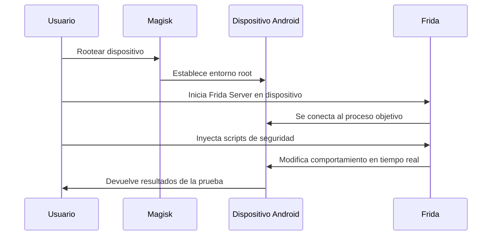

# 📱Android Security Testing con Frida y Magisk👾

Este proyecto ofrece una guía completa para configurar y utilizar Frida y Magisk, facilitando las pruebas de seguridad en aplicaciones Android en dispositivos físicos rooteados. A través de este documento, exploraremos cómo instrumentar aplicaciones de manera dinámica para identificar vulnerabilidades de seguridad potenciales.

## Tabla de Contenidos
- [Introducción](#introducción)
- [Requisitos Previos](#requisitos-previos)
- [Instalación](#instalación)
  - [Instalar ADB](#instalar-adb)
  - [Preparación del Entorno en el Escritorio](#preparación-del-entorno-en-el-escritorio)
  - [Pasos Iniciales en el Dispositivo Físico](#pasos-iniciales-en-el-dispositivo-físico)
- [Uso](#uso)
- [Solución de Problemas](#solución-de-problemas)
- [Causas Comunes del Error al Inyectar Código](#causas-comunes-del-error-al-inyectar-código)
- [Evidencias de Funcionamiento](#evidencias-de-funcionamiento)
- [Flujo de Pruebas de Seguridad en Android con Frida y Magisk](#flujo-de-pruebas-de-seguridad-en-android-con-frida-y-magisk)
- [Contribuir al Proyecto](#contribuir-al-proyecto)

## Introducción

Este documento es una guía detallada para configurar y utilizar las herramientas Frida y Magisk con el fin de realizar pruebas de seguridad en aplicaciones Android. Este proceso se lleva a cabo en un dispositivo físico rooteado, abarcando desde la instalación de las herramientas necesarias hasta la ejecución de Frida Server en el dispositivo.

## Requisitos Previos

Para seguir esta guía, es necesario contar con un dispositivo Android rooteado con Magisk. A continuación, se detallan las especificaciones del equipo utilizado para las pruebas:

- **Dispositivo Android rooteado con Magisk:**
  - **Versión de Magisk:** v28.1 (28104)
  - **Dispositivo:** Xiaomi Redmi Note 8 (2021) - M1908C3JGG
  - **Arquitectura:** arm64-v8a
  - **Versión de Android:** 13
  - **Nivel API:** 33

## Instalación

### Instalar ADB

ADB (Android Debug Bridge) facilita la comunicación entre tu dispositivo Android y tu computadora. Para instalar ADB globalmente en Windows, sigue estos pasos:

1. **Descargar el SDK Platform Tools** desde el [Página Oficial](https://developer.android.com/tools/releases/platform-tools) de desarrolladores de Android, que incluye ADB y otras herramientas útiles.
2. **Extraer el Archivo ZIP** en una carpeta de tu elección, por ejemplo, `C:\adb`.
3. **Configurar la Variable de Entorno:**
   - Haz clic derecho en "Este PC" o "Mi PC" y selecciona "Propiedades".
   - Ve a "Configuración avanzada del sistema" > "Variables de entorno".
   - En "Variables del sistema", encuentra y edita la variable "Path".
   - Añade la ruta donde extrajiste el SDK Platform Tools, por ejemplo, `C:\adb`.
   - Aplica los cambios.
4. **Verificación:** Abre una nueva ventana de línea de comandos y ejecuta `$ adb version` para verificar la instalación.

### Preparación del Entorno en el Escritorio

Antes de comenzar con el dispositivo, asegúrate de tener Python instalado (Versión > 3.9). Puedes descargar Python desde la [Página Oficial de Python](https://www.python.org/downloads/).

Instala Frida CLI con PyPI ejecutando el siguiente comando en tu terminal:
> `$ pip install frida-tools`

Selecciona la versión de Frida-Server que sea compatible con tu dispositivo desde la [Página Oficial de Versiones de Frida](https://github.com/frida/frida/releases). En este caso, utilizaremos `frida-server-16.2.1-android-arm64`.

### Pasos Iniciales en el Dispositivo Físico

Para preparar tu dispositivo para las pruebas:

1. **Obtener Acceso Root y Preparar el Sistema:**
   - Conecta el dispositivo a tu PC vía USB en modo Depuración.
   - Abre una terminal o PowerShell y ejecuta los siguientes comandos:
     ```
     $ adb push frida-server-16.2.1-android-arm64 /data/local/tmp/
     $ adb shell
     $ su
     $ chmod 755 /data/local/tmp/frida-server-16.2.1-android-arm64
     $ /data/local/tmp/frida-server-16.2.1-android-arm64 &
     ```
   - Tras ejecutar el último comando, si la consola se queda en negro, es una buena señal de que el servidor de Frida está en ejecución.
   - Para verificar, ejecuta en una nueva consola:
     ```
     $ frida-ps -Uai
     ```
     Este comando lista todos los procesos en ejecución en el dispositivo objetivo.

## Uso

Para comenzar con las pruebas de seguridad:

1. **Inyectando Código JavaScript:**
   - Puedes inyectar tu propio código JavaScript personalizado o utilizar scripts existentes adecuados para el análisis que deseas realizar.

2. **Ejecutando tu Script:**
   - Utiliza el siguiente comando como ejemplo para ejecutar tu script:
     ```
     $ frida -U -f <nombre_del_paquete> -l <script.js>
     ```
   - Si la ejecución es exitosa, habrás logrado inyectar código para tus pruebas de seguridad.

3. **Captura de Tráfico de Red:**
   - Para capturar el tráfico de red de la aplicación objetivo, puedes utilizar herramientas como:
     - BurpSuite
     - HTTP Toolkit
     - HTTP Debugger

## Solución de Problemas

### Error al Inyectar Código

Si te encuentras con el error `Failed to spawn: unexpectedly timed out while waiting for signal from process with PID`, no te preocupes, es un problema común relacionado con las configuraciones del dispositivo o incompatibilidades de versión. A continuación, te explicamos cómo solucionarlo paso a paso:


Este problema puede surgir por diversos motivos, incluyendo la ejecución simultánea de múltiples instancias de Frida-Server o configuraciones restrictivas en tu dispositivo. Para solucionarlo, sigue estos pasos:

1. **Detener Todas las Instancias de Frida-Server:**
   - Conecta tu dispositivo Android y abre una terminal o PowerShell.
   - Inicia una sesión shell en tu dispositivo con `$ adb shell`.
   - Busca todos los procesos de Frida-Server ejecutándose con `$ ps -A | grep frida`.
   - Observarás una salida similar a la siguiente:
     ```
     root 30219  30201 2246444  4980 0  0 S frida-server-16.2.1-android-arm64
     ```
   - Detén el proceso utilizando su PID con el comando `$ kill -9 30219`.

2. **Modificar Configuraciones del Sistema:**
   - Asegúrate de que tu dispositivo esté en modo desarrollador y con la depuración USB habilitada.
   - Ejecuta los siguientes comandos en la shell de adb:
     - `$ su` para solicitar privilegios de superusuario.
     - `$ mount -o remount,rw '/'` para remontar el sistema de archivos raíz como lectura-escritura.
     - `$ chmod 777 /` para establecer permisos permisivos en el directorio raíz (nota: esto puede tener implicaciones de seguridad).
     - `$ setenforce 0` para poner SELinux en modo permisivo, permitiendo operaciones bloqueadas por las políticas de SELinux.
     - `$ setprop persist.device_config.runtime_native.usap_pool_enabled false` para desactivar el pool de aplicaciones no solicitadas (USAP).
     - `$ settings put system screen_off_timeout 100000000` para evitar que la pantalla se apague rápidamente debido a inactividad.
     - `$ exit` para salir de la shell de superusuario y luego `$ exit` nuevamente para salir de la shell de adb.

3. **Reinicia Frida-Server:**
   - Regresa a los [Pasos Iniciales en el Dispositivo Físico](#pasos-iniciales-en-el-dispositivo-físico) y sigue las instrucciones para reiniciar Frida-Server en tu dispositivo.

Este proceso debería solucionar el problema y permitirte continuar con las pruebas de seguridad de tu aplicación Android utilizando Frida y Magisk. Si encuentras otros errores o necesitas más ayuda, considera buscar en foros de desarrollo Android o en la documentación oficial de Frida y Magisk para obtener más información y soporte.

### Causas Comunes del Error al Inyectar Código

El error `Failed to spawn: unexpectedly timed out while waiting for signal from process with PID` al utilizar Frida en Android puede estar causado por varias características de seguridad integradas en el sistema operativo, que incluyen:

- **Android Guarded Pointer Bumps (GPB):** Una medida de seguridad para proteger contra ataques de corrupción de memoria, que puede alterar la inyección de código de Frida al modificar el manejo de punteros en aplicaciones.
- **SELinux (Security-Enhanced Linux):** Aplica políticas de seguridad estrictas que pueden limitar la capacidad de Frida para interactuar con otros procesos, especialmente aquellos protegidos por políticas de SELinux.
- **Unsolicited Application Pool (USAP):** Mejora el rendimiento de inicio de aplicaciones en Android 10 y versiones superiores, pero puede complicar la inyección de código de Frida al manejar de manera diferente la creación de procesos de aplicación.

Estas capas de seguridad y gestión de procesos pueden dificultar la instrumentación dinámica de aplicaciones con Frida. Para sortear estos obstáculos, se pueden adoptar estrategias como:

- **Desactivar SELinux o configurarlo en modo permissivo:** Aumenta los riesgos de seguridad, recomendado solo en entornos controlados.
- **Modificar políticas de SELinux:** Permite las acciones requeridas por Frida, requiere conocimiento avanzado de SELinux.
- **Adaptarse a GPB y USAP:** Puede requerir esperar por actualizaciones de Frida o buscar métodos alternativos de instrumentación.

En conclusión, la interacción entre Frida y estas características de seguridad de Android requiere un manejo cuidadoso y un enfoque informado para superar los desafíos presentados por el sistema operativo. -->

### Error al ejecutar el servidor de Frida


En las versiones recientes de Android, el runtime ART bloquea ciertos hooks de Frida y provoca este mensaje en frida-java-bridge:

**Causa:** el paquete `com.google.android.art` impide que Frida modifique la VM de Java.

**Solución rápida:** desinstalar dicho paquete antes de arrancar Frida:

```bash
adb shell pm uninstall com.google.android.art
```
---
## Evidencias de Funcionamiento

En esta sección, se incluyen imágenes y pruebas de las herramientas en acción para demostrar su eficacia en entornos reales. Estas evidencias ayudan a validar la utilidad y el impacto de Frida y Magisk en la seguridad de aplicaciones Android.


*Resolver el problema relacionado con el error `Failed to spawn: unexpectedly timed out while waiting for signal from process with PID` ha sido un logro muy gratificante. Por ello, comparto con entusiasmo esta imagen que evidencia la solución documentada, con la esperanza de que sea de utilidad para todos los apasionados de la informática.*

## Flujo de Pruebas de Seguridad en Android con Frida y Magisk
                    



## Contribuir al Proyecto

¿Interesado en contribuir? Esta sección detalla cómo puedes aportar al proyecto, ya sea reportando bugs, sugiriendo mejoras, contribuyendo con código o documentación, y otras formas de participación.
